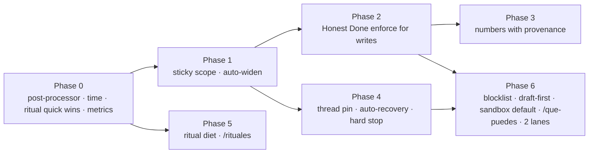

# Jarvis Usability Plan — from the 2026-08-22 critic review

**Source:** 12-agent critic swarm over 816 real exchanges (2026-07-08 → 08-22), 205 ritual outputs, 820 chat tasks, benchmarked vs 26 personal agents. Report: https://claude.ai/code/artifact/805801b6-49f5-4493-946d-d4f7e07f0d3d · raw packs: session scratchpad `jarvis-review/swarm-result.json`.
**Verdict:** 4.7/10 from the user's seat vs a 2026 bar of ~7.5–8. Wins on project memory and strategic pushback; loses on the three things felt daily — doing what it says, saying only what matters, never asking the user to speak its internal language.
**Status:** Phase 0 SHIPPED 2026-08-23 (`950514e`; §7). Phase 1 SHIPPED 2026-08-23 (§8). Phases 2–6 open; order is by user impact × frequency.

---

## 0. Targets (measured from `mc.db`, re-runnable)

| KPI                                     | How measured                                                                                                         | Baseline (45d)                              | Target (8 wks)                                           |
| --------------------------------------- | -------------------------------------------------------------------------------------------------------------------- | ------------------------------------------- | -------------------------------------------------------- |
| Friction rate                           | user msgs that are corrections / `Continúa` / tool incantations / "no agotes tus turnos" ÷ all user msgs             | ~17–26 % (shard tallies 34/54/36/39 of 204) | ≤ 8 %                                                    |
| Scope-ask replies delivered             | replies matching `no está en (el )?scope\|no aparece en (mi\|tu) lista\|pídeme con "usa`                             | 37                                          | **0**                                                    |
| Tool incantations by user               | user msgs starting `usa (shell\|gemini\|schedule\|tweet\|file_\|git_)`                                               | ~25–32                                      | ≤ 3 (residual approvals only)                            |
| Raw harness strings delivered           | `\[error_max_turns\|\[Task failed\]\|STATUS: \|\[timeout after\|\[positive feedback\|Goal complet` in delivered text | ~25 + 6 placeholders                        | **0**                                                    |
| English-first chat replies              | reply first 200 chars language ≠ es                                                                                  | ~15                                         | 0                                                        |
| Empty / silent replies (docx, PDF)      | chat task completed with reply length < 20                                                                           | 4                                           | 0                                                        |
| False-done claims                       | operator-tagged (`reactions` / weekly manual tally of "Listo" followed by user disproof within 3 turns)              | ≥ 15                                        | ≤ 2, all caught by the gate before delivery              |
| Figures without provenance in artifacts | numbers written to Sheet/Doc/KB lacking `fuente:` or `calc:`                                                         | uncounted (≥ 5/shard fabrications)          | 0 in artifacts; chat figures flagged `~ (sin verificar)` |
| Ritual pushes / day · words / day       | `tasks` ritual rows delivered per MX day                                                                             | 9.3 · ~3,000                                | ≤ 4 · ≤ 700                                              |
| Ritual repeats                          | identical-topic pushes > 2 days running                                                                              | Química ×13, PM ×19, Signal item 14/21      | 0 beyond 2                                               |
| Time errors                             | wrong weekday / TZ in delivered text                                                                                 | ≥ 5                                         | 0                                                        |
| Chat latency                            | p50 / p90 created→completed                                                                                          | 47 s / 160 s                                | 25 s / 90 s                                              |
| Auto-recovered failures                 | failed chat tasks retried by harness before delivery                                                                 | 0 of 10                                     | 100 % of retryable classes                               |
| Stop honoured                           | `Para\|Detente\|Cancela` → all running tasks cancelled + 1-line confirm                                              | 0 of 3                                      | 3 of 3                                                   |

Ship `scripts/usability-metrics.ts` in Phase 0 so every KPI above is one command (`./mc-ctl usability 7`). Re-run the critic swarm at week 4 and week 8 against the same rubric.

---

## 1. Principles that bind every phase

1. **The user never reads a system string.** Tool names, scope groups, runner banners, STATUS lines, English sub-agent prose — none of it is deliverable. A delivery post-processor is the structural gate (`structural_safety_gate`: no code path to the dangerous value).
2. **"Listo" is a claim; the harness decides.** Completion needs evidence read back from the artifact, not asserted by the model (`completion-is-a-claim-ledger-decides`). V8.4 already owns `task_gates` — this plan arms it, it does not build a parallel mechanism.
3. **Silence beats filler.** A ritual that has nothing new sends nothing (OpenClaw/nanobot heartbeat model). Every push carries a "why now" the reader can see.
4. **Frequency-weighted blast radius.** Each change lists every population it touches (chat, WA group, email, rituals) and the 30-day frequency per flip (`structural-rule-blast-radius-is-frequency-weighted`).
5. **Mutation-verify everything.** Every gate ships with a test that breaks it and shows RED; wiring tests at every fail-open point.
6. **Operator-owned rulings stay.** Hard-cap enforcement (V8.5) is CLOSED by operator; the Rumi SOP golden rule stays; write tools stay always-on (05-07 directive). The plan works around these, not through them.

---

## 2. Phases

### Phase 0 — Stop the bleeding (week 1, all `small`)

Highest frequency × lowest effort. Nothing here changes what Jarvis can do; it changes what reaches the phone.

**0.1 Delivery post-processor** — `src/messaging/post-filter.ts` (extend) + wire at the single delivery seam in `src/messaging/router.ts` (the point where `tasks.output.text` becomes a Telegram/WA/email send).

- Strip: `[error_max_turns…]`, `[timeout after …]`, `[Task failed] …`, `STATUS: …`, `[positive feedback acknowledged]`, `Goal complet(ed|ado) ✅` blocks, `Single-goal chat task completed…` meta-summaries, leading process narration lines (`^(Voy a|Ahora|Tengo (suficiente|todo)|I'll|Let me)…` when followed by real content).
- Replace a stripped failure with **one Spanish line + next step**: `Se me acabó el presupuesto del turno a mitad de <step>. ¿Sigo?` / `Se cayó la sesión de Google; ya la renové, ¿reintento?`.
- Language guard: if the first 200 delivered chars are English on a Spanish channel and the user did not write in English → route through a 1-call translate-or-summarize before send (reuse the SDK fast path; bounded to 1 retry).
- Never send empty: if post-processed text < 20 chars → send `No pude leer el archivo (.docx). Mándalo como PDF o pégame el texto.` (class-specific when the failure is known, generic otherwise).
- Tests: every marker listed above has a RED→GREEN fixture; a wiring test asserts the router cannot deliver without passing through the filter (`verification_that_cannot_fail`).
- Populations: chat (Telegram/WA/email), ritual delivery (same seam), A2A replies are out of scope (machine consumers).

**0.2 Time is computed, never reasoned** — `src/messaging/prompt-sections.ts` "Fecha y hora" + `src/rituals/*` prompt builders.

- Inject `{weekday_es, date_mx, time_mx, tz}` from code into every prompt; remove any "calcula el día" instruction (Posthumanismo ritual preamble).
- Ritual window guard: a ritual firing outside `[scheduled − 5 min, scheduled + 60 min]` (late restart catch-up) is skipped with a log line, not delivered as "Son las 8am".
- Fix `pm-daily-rebalance` timezone (`America/New_York` → `America/Mexico_City`) in `src/rituals/config.ts`.

**0.3 Ritual quick wins** — `src/rituals/config.ts` + the three affected ritual modules.

- Química: repeat at most 2 unanswered days, then one line `¿Pausamos las tarjetas de química?` and auto-pause until the user answers (the operator's "repeat until answered" rule is honoured for 2 days, not 13 — surface this change to the operator, see §5).
- PM daily rebalance: deliver only when orders > 0, rejections change, or the run fails; otherwise write to `project_log` silently.
- Evolution log: stop broadcasting; commit to `docs/EVOLUTION-LOG.md` only (already does) and fold a 2-line summary into Morning Sync.
- Nightly close: move from 22:00 to 23:59 MX so late sessions are not reported as "día silencioso".

**0.4 `scripts/usability-metrics.ts` + `./mc-ctl usability <days>`** — the §0 table from `mc.db`, printed as one block. Ships first so Phases 1–5 have a before/after.

Exit: 7 days with 0 raw harness strings, 0 English-first replies, 0 empty replies, ≤ 6 pushes/day.

---

### Phase 1 — Kill the magic-word protocol (weeks 1–2, `medium`)

Root cause from the capability pack: scope is evaluated **per message** by `classifyScopeGroups` (`src/messaging/scope-classifier.ts`), so a short follow-up (`Continúa`, `confirmo`) drops the group the previous turn needed, and a miss makes the model ask the user to retype with a keyword. The user has become the router.

**1.1 Sticky thread scope** — `src/messaging/scope.ts` resolver.

- Persist the resolved group set per thread with a TTL (e.g. 45 min sliding) in a small `thread_scope` table or the existing thread buffer metadata. Resolution = `classify(message) ∪ sticky(thread)`.
- Short follow-ups (< 6 words, confirmation verbs from `confirmation-verbs.ts`, `Continúa/Sigue/Termina`) inherit the full previous set unconditionally.

**1.2 Scope-miss auto-widen and silent re-run** — `src/runners/fast-runner.ts` + `src/messaging/router.ts`.

- Detector: the model's output matches a scope-ask pattern (`no está en (el )?scope`, `no aparece en mi lista`, `pídeme con "usa …"`, `ToolSearch` returning 0 for a known tool name) OR the model calls a known-but-out-of-scope tool name.
- Action: map the requested tool → its group (`scope.ts` already groups), add the group to the thread's sticky set, **re-run the same turn once** with the widened scope, no message to the user. Telemetry row in `scope_telemetry` (`miss`, tool, group, re-run outcome).
- If the re-run also fails → deliver the post-processed failure line (Phase 0), never the scope-ask text.
- Post-filter hard block: a scope-ask reply can never be delivered (belt and braces).

**1.3 Approvals in plain Spanish, answered with "sí"** — `src/messaging/confirmations.ts`.

- Where a real approval gate exists (the 21-tool confirmation set), the question is task-phrased (`¿Ejecuto el script en el VPS?`, `¿Publico el tweet?`), never tool-phrased. The `sí/ok/dale/adelante` reply resolves the gate **and** carries the scope (1.1).
- Add a per-thread `allow-always` for the session (Hermes/OpenClaw model) for low-risk groups (shell read-only, browser, Gemini).

**1.4 Token budget check** — the reason scoping exists. Measure the always-on prompt delta of sticky scope on a 7-day replay; if > 15 % tokens/turn, keep per-message classification but make 1.2 (auto-widen) the safety net. 1.2 alone removes the user-visible protocol.

Tests: replay the 37 scope-ask exchanges from the corpus through the resolver → 0 deliver a scope-ask; `confirmo eliminación` after a delete proposal resolves with the prior scope; mutation test disables the detector → RED.
Exit: 7 days with 0 scope-ask replies and ≤ 3 user incantations.

---

### Phase 2 — Honest Done: `Listo` becomes a verified claim (weeks 2–3, `medium`)

V8.4 shipped `task_gates` dormant/shadow on 08-16 (`66bc8b6`). This phase gives it the write-tool criteria it needs and flips it to enforce for that class only.

**2.1 Read-back verifiers per write class** — `src/tools/builtin/*` handlers register a `verify()` alongside the write:

- Google Sheets/Docs: re-read the range/doc after write; return the key cells/first lines; the reply's "Listo" block is rendered **from the read-back**, not from the model's intent (Soriana case #11959: the gate would have shown `$12 MDP (30%)` vs the confirmed `16 MDP (40%)` and blocked).
- KB (`jarvis_files`): re-read `updated_at` + content hash after `upsertFile`; "KB actualizado" requires hash change (#11750/#11820 class).
- Deploy / service: `systemctl is-active` + one endpoint probe (`200 OK` proof pattern from #11992 becomes mandatory, not optional).
- Account/user creation (Stalwart, WP): a login/lookup probe after create (#11181 class).
- DB writes: `SELECT` the row back.

**2.2 Gate wiring** — `task_gates` `met` requires the verifier's evidence string; `ABANDON` path renders `No quedó: <what failed>` through the Phase 0 post-processor. Mode: enforce for write classes, shadow for everything else (first `mc-ctl gates summary 7` readout decides widening).

**2.3 Confirmed-model read-back** — when the user confirms a model/numbers in chat (`Confirmo`, `ok con esos números`), pin the confirmed figures to the thread (Phase 4 scratch) and have the Sheet/Doc verifier diff against them; mismatch = gate fails.

Tests: each verifier has a fixture where the write silently fails (mock) → gate ABANDON → delivered text contains `No quedó`; mutation: remove verifier registration → wiring test RED.
Exit: 14 days, ≥ 1 gate block observed in production (`gate-pass-must-have-a-consumer` — enforce must have visibly stopped a false "Listo"), 0 user-disproved "Listo".

---

### Phase 3 — Numbers with provenance (weeks 3–4, `medium`)

**3.1 Deterministic counts** — any stat over a file/CSV/DB is computed by code (`shell_exec`/`pdf_read` + a `count_rows`/`summarize_csv` tool), never by the model reading and estimating (#11898: 94 rows reported as 100).
**3.2 Provenance tag on artifact writes** — the Sheets/Docs/KB write handlers reject a numeric claim block that lacks `fuente: <url>` or `calc: <expression>`; figures from memory render as `~X (sin verificar)` in chat and are **not written** into artifacts. Implement as a handler-level check on the structured payload, not as a prompt plea.
**3.3 Citation existence check** — research deliverables: every `[n]`/DOI/title cited is resolved once via `web_read`/`exa_search`; unresolved → dropped with a one-line note (#11685 five fabricated papers).
**3.4 Market data** — price/market-cap/P&E from the finance tools that already exist (`FINANCE_TOOLS`) and are never invoked (0 uses in 45 days): route "prospecto/valuación/precio de <ticker>" to them by scope group, and forbid price figures without a tool result (#11265 BSX).

Exit: 0 unsourced figures in artifacts over 14 days (metrics script greps artifacts' write payloads).

---

### Phase 4 — Continuity and recovery (weeks 4–6, `medium`)

**4.1 Per-thread artifact pin** — `src/memory/` thread scratch: every URL Jarvis creates or the user shares, every confirmed number, every deliverable ("built today" ledger) is pinned and injected first in the next turns (#11954 P&L forgotten 2 turns later; #12384 own demo "unbuilt").
**4.2 Image attachment expiry** — an image is context for the turn it arrives in (+1 turn if the user refers to it); never re-injected afterwards (13 stale-image hijacks in shard 4).
**4.3 Auto-recovery before delivery** — `src/dispatch/` + `src/inference/claude-sdk.ts`:

- retry once on `Planning failed: unparseable JSON`;
- OAuth expiry → refresh + retry (never deliver `401 … revoked` ×4);
- `error_max_turns` / 900 s timeout → checkpoint-resume once with the same sticky scope; deliver partial + `¿Sigo?` only if the resume also caps;
- orphaned-on-restart tasks are re-queued, not silently dropped (#07-12 03:23).
  **4.4 Hard stop** — `Para|Detente|Cancela|Alto` (standalone or leading) cancels all running tasks for the thread (`src/messaging/cancel.ts` exists) and replies one line `Detenido: <n> tareas canceladas.` Never a clarifying question, never a greeting (#11367–11369).
  **4.5 Turn budget is the harness's problem** — remove the user's need to say "No agotes tus turnos": long coding tasks route to the sandboxed/heavy runner by classification (`src/dispatch/classifier.ts`), with checkpoint-resume (4.3) as the safety net.

Exit: 0 `No agotes tus turnos` / bare `Continúa` after a failure in 14 days; 3/3 stops honoured in a scripted test + 1 live.

---

### Phase 5 — Ritual diet and phone-side control (weeks 4–6, `medium`)

**5.1 Sent-before ledger** — `rituals/` shared helper: hash each item/finding delivered; a ritual drops items already sent in the last N days (Signal 14/21 repeats; Pharma 15-day Tudriqev; Posthumanismo).
**5.2 Change-only delivery** — a ritual with zero new items sends nothing and logs `silent: no change` (heartbeat model); the metrics script counts silences as a success.
**5.3 Merge the nightly trio** — nightly close + day narrative + evolution summary → one 23:59 message ≤ 250 words; narrative + log stay on disk/KB.
**5.4 Signal digest memory** — compare against yesterday's depot; a ≥ 10 % move in a tracked asset is a lead line, "estables" is forbidden when a tracked series moved (BTC +22 % case).
**5.5 `/rituales`** — phone command: list active rituals with next fire time, `pausa <id>`, `reanuda <id>`, `silencio hasta <hora>`; backed by `scheduled_tasks.enabled` + a per-ritual `muted_until`. (ChatGPT Scheduled page / Gemini Scheduled Actions parity, from the chat.)
**5.6 Reading budget** — a daily cap (4 pushes, 700 words) enforced at the delivery seam; lower-priority rituals queue into Morning Sync when the cap is hit.

Exit: ≤ 4 pushes/day, ≤ 700 words/day, 0 repeats > 2 days, Morning Sync untouched.

---

### Phase 6 — Graduated autonomy, discoverability, latency (weeks 6–8, `large`)

**6.1 Non-bypassable blocklist** (Hermes hardline model) — implemented below the model: a shell-exec policy that denies `0.0.0.0` / `--host 0.0.0.0` listeners, direct writes to `data/mc.db` outside migrations, variable-substitution evasion of the keyword guard (detect `${…}` / `$VAR` assembly of blocked tokens), and `jarvis_file_delete` from a message that does not name the files. No mode, scope or prompt can lift it (`structural_safety_gate`).
**6.2 Draft-first for outbound-as-another-identity** — email replies signed as an organisation, tweets, WA group messages on behalf of the team → draft to the operator, send on `sí` (Lindy/Comet confirm-before-act bar). Personal Telegram replies stay direct.
**6.3 Coder tasks default to the sandboxed runner** — anything touching git/tests/PRs classifies to nanoclaw/heavy with checkpointing; fast-runner keeps chat, research, docs. (Depends on the queued nanoclaw `:ro` mount fix — `task-sandbox-db-write-deadend.md`.)
**6.4 `/que-puedes`** — Spanish capability answer grouped by outcome (investigar · construir · publicar · recordar · monitorear · finanzas) without tool names, generated from `scope.ts` groups + one example phrase each; plus `/costo` (today's spend, last turn's cost).
**6.5 Latency** — the runner queue is serial (queue waits up to 26 min). Add a second lane for chat-class turns so a long coding task never blocks a question (`serial_under_deadline_starvation`); measure p50/p90 before/after.
**6.6 Spanish quality pass** — accent/orthography check on outbound content tools (tweet, WP, email) via a deterministic checker before send (shard 1: `analítica/construyo/tecnologica` errors right after fixing 80 on the landing).

Exit: blocklist mutation tests RED on each rule; 1 live draft-first flow; `/que-puedes` answers from the phone; p50 ≤ 25 s.

---

## 3. Sequencing

Phases 0 and 5 are independent of everything; 1 unlocks 2 and 4 (both need sticky scope to re-run turns); 6 last because it changes autonomy defaults and needs the gates from 2 in place.

## 4. What this plan deliberately does not do

- Does not arm V8.5 hard-cap enforcement (operator-closed).
- Does not re-gate write tools (05-07 directive) — it adds read-back verification instead.
- Does not add an SDK-level retry on content-filter 400s (08-21 ruling; SOP PASO 2b covers it).
- Does not rebuild memory on embeddings/pgvector (separate dormant project) — Phase 4 is a thread-scoped pin, not a recall engine.
- Does not touch the WhatsApp/Piotr group surface beyond the delivery filter: 0 observed group traffic in 45 days; confirm with the operator whether it is unused or excluded from the export before designing for it.

## 5. Operator rulings (2026-08-22)

1. **Química rule** — RULED: 2 unanswered repeats, then `¿Pausamos las tarjetas de química?` and auto-pause until answered.
2. **Ritual kill list** — RULED: evolution-log broadcast OFF (disk commit only, 2-line summary in Morning Sync); PM daily rebalance change-only (orders > 0, rejections changed, or run failed); nightly close + day narrative + evolution summary merged at 23:59 MX. Morning Sync untouched.
3. **Allow-always groups** (1.3) — RULED: shell read-only, browser, Gemini, Google read. Never: shell write, git push, tweet, email send, deletes.
4. **Draft-first identities** (6.2) — RULED: all email sent as an organisation, tweets, WA group posts. Personal Telegram replies stay direct.
5. **Second runner lane** (6.5) — RULED: yes, chat-class turns only on lane 2; memory ceiling; revert to one lane if pressure shows in week 1.
6. **WhatsApp / Piotr surface** — RULED: **Piotr lives on Telegram only.** WhatsApp is left dormant for a future deploy: channel wiring stays in the tree but is not started, and the WA-group persona block is removed from every prompt (token saving, no behavioural loss — 0 WA traffic in 45 days). Re-enabling is a config flip, not a rebuild.

## 6. Verification cadence

- Every phase: scoped vitest for touched files, full suite via the pre-commit hook, mutation test per gate, one live production check of the exact behaviour that was broken (quoted exchange id from the review as the reproduction).
- Weekly: `./mc-ctl usability 7` → the §0 table; drift in any KPI reopens the phase.
- Week 4 and week 8: re-run the critic swarm (same rubric, same shard sizes) and publish the delta next to the 08-22 artifact.

## 7. Phase 0 ship record (2026-08-23)

Shipped in `950514e`: 0.1 deliverable filter (`src/messaging/deliverable-filter.ts`, wired at all four send seams, `{raw:true}` for router-authored diagnostics) · 0.3 ritual delivery policy (`src/rituals/delivery-policy.ts` + `ritual_deliveries` ledger; nightly-close 23:50; pm 07:00 MX; `[PAUSAR-SCHEDULE]` sentinel + `mc-ctl schedule-resume`) · 0.2 manual-run time note · 0.5 Piotr/WhatsApp block conditional on `WHATSAPP_ENABLED` (eval:gate PASS) · 0.4 `./mc-ctl usability [days]`. Schedule prompts updated in `scheduled_tasks` (Química 2-then-pause; Posthumanismo "no muestres el cálculo del día"; Morning Sync PASO 4 = 2-line evolution fold, `file_read` added) — backups in the session scratchpad.

**R1 audit (qa-auditor, replayed 387 real replies + 6 real PM reports) FAILED the first cut; all findings folded:** C1 filename dots ended sentences mid-token → terminator must be followed by whitespace/EOS/uppercase/emoji; C2 a `reserve` constant voided the "≥80 chars must remain" guard → guard measured without the filter's own line; C3 error regexes fired on replies that QUOTED an error → line-anchored + fenced-code exempt; W1 PM gate silenced 0/6 (fingerprint scraped prices/dates; "stale" is in the prompt's own format) → per-field fingerprint, negated mentions excluded; W3 `broadcastToAll` rewrote router alerts → `raw` opt-out; W5–W7 metrics read post-filter text / no double-subtract / plan-exact regexes; W8 background notice keeps the failure line past the 500-char cap.

**Deviations from §2 Phase 0 as written:** (a) the ritual *window guard* is not needed — `checkAndExecuteSchedules` fires only on an in-minute cron match and `scheduleCron` has a 60 s tolerance with no catch-up path; the 17:15 "Son las 8am" case was a manual run, now labelled. (b) "merged at 23:59": the nightly close (23:50) is the single evening message; day-narrative and evolution-log persist but are not broadcast; the evolution summary is folded into Morning Sync (PASO 4), not into the close. (c) The filter does not translate English replies — it strips English narration/preamble when Spanish content follows and flags the rest (`englishLeading`) for the KPI; translation is Phase 1+ work.

**Verify over the first week:** `./mc-ctl usability 7` → harness 0 · English ↓ · pushes/day ≤ 7 (the ritual diet lands fully with Phase 5); `journalctl -u mission-control | grep deliverable-filter` shows what was stripped; PM at 07:00 MX is silenced on an unchanged day (`SELECT * FROM ritual_deliveries`); the Química run at 13:00 MX pauses itself (row `active=0`) on the first run, since 13 repeats already exceed the new limit.

## 8. Phase 1 ship record (2026-08-23)

**1.1 Sticky thread scope** — `decideActiveGroups` unions this turn's classification with the prior thread scope (45-min SLIDING window; a conversational closer does not inherit). The carried prior is the turn's own BASE classification plus any scope-miss widening — never the union — so the set is bounded (R1 audit measured the union-all variant at 29 → 80 tools by turn 10; the shipped rule re-measured 29/50/50/50/62/76 vs 29/38/50/50/62/59 without stickiness). Implemented in memory (`previousScopeGroups` + `previousScopeAt`), not the `thread_scope` table §2 sketched — lost on restart, which is acceptable for a 45-min window.

**1.2 Scope-miss auto-widen** — `src/messaging/scope-miss.ts`: `detectScopeMiss` recognises the corpus's ask shapes in the LAST 700 chars of a reply (an ask the model worked around mid-reply is not a miss), harvests the requested tool identifiers (snake_case and `mcp__x__y`), and labels the ask STRONG (explicit request) or weak (scope mention). The router then: widens by the NARROWEST group that supplies each missing tool (`groupsForTool` subtracts the always-on baseline and spans classifier + regex groups), rebuilds the system prompt for the widened list, re-runs the SAME turn once (original tags incl. `skill:` ids, fresh time line, Telegram placeholder reset so the answer lands in place), and never delivers the ask. Strong ask with every tool already in scope (the model refused a tool it had — corpus 12465) → re-run with the same tools plus a system correction note. Weak mention with nothing missing → deliver as-is. No group supplies the tool → one honest line, no keyword. A miss on the re-run itself → one honest line. The swallowed turn records no outcome and no skill failure.

**Prompt** — both places that taught the operator's incantation (identity rule + `## REGLA CRÍTICA: Solo usa herramientas disponibles`) now say: name the tool in one line and stop; the system activates it. The DENUE advisory in `fast-runner.ts` says the same. eval:gate PASS twice (65.53, then 65.20 vs incumbent 65.75; tolerance 2).

**1.3 Approvals** — NOT shipped: no tool in the ruling-3 allow-always groups (shell-ro, browser, gemini, google-read) is confirmation-gated (gates sit on share/delete/create/update/tweet/wp/video), so "allow-always" has an empty population; confirmation verbs already accept sí/ok/dale; sticky scope (1.1) is what makes "sí" carry the prior scope. Re-open if a read-only tool ever gains a gate.

**1.4 Token budget** — measured on telemetry (above); no ceiling breached; the re-run is a full duplicate turn (~25 per 45 days at the corpus rate).

**Audits** — R1 FAIL (Telegram streamed ask stayed on screen; prompt still taught "usa X" 30 lines below; always-on tool → 23 groups → 173 tools; recall ~50%), R2 FAIL (`base` aliased the mutated Set on the inherited branch; hallucinated ask delivered verbatim; regex-only groups unreachable; `mcp__` identifiers invisible; narrow-list prompt replayed), R3 → see commit. Every finding has a fixture quoting the corpus exchange id.

**Verify over the first week:** `./mc-ctl usability 7` → scope-ask replies 0, incantations ≤ 3; `journalctl -u mission-control | grep scope-miss` shows `re-running turn silently` lines and their outcomes; `SELECT message, active_groups FROM scope_telemetry WHERE message LIKE '[scope-miss rerun]%'`.

