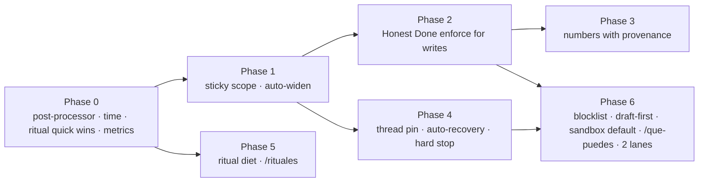

# Jarvis Usability Plan — from the 2026-08-22 critic review

**Source:** 12-agent critic swarm over 816 real exchanges (2026-07-08 → 08-22), 205 ritual outputs, 820 chat tasks, benchmarked vs 26 personal agents. Report: https://claude.ai/code/artifact/805801b6-49f5-4493-946d-d4f7e07f0d3d · raw packs: session scratchpad `jarvis-review/swarm-result.json`.
**Verdict:** 4.7/10 from the user's seat vs a 2026 bar of ~7.5–8. Wins on project memory and strategic pushback; loses on the three things felt daily — doing what it says, saying only what matters, never asking the user to speak its internal language.
**Status:** Phase 0 SHIPPED 2026-08-23 (`950514e`; §7). Phase 1 SHIPPED 2026-08-23 (§8). Phase 2 SHIPPED 2026-08-23 (§9). Phase 3 SHIPPED 2026-08-23 (§10). Phase 4 SHIPPED 2026-08-24 (§11 — incl. 2.3 and the flailing-guard fold-in). Phase 5 SHIPPED 2026-08-24 (§12 — two operator rulings pending). Phase 6 open.

---

## 0. Targets (measured from `mc.db`, re-runnable)

| KPI                                     | How measured                                                                                                         | Baseline (45d)                              | Target (8 wks)                                           |
| --------------------------------------- | -------------------------------------------------------------------------------------------------------------------- | ------------------------------------------- | -------------------------------------------------------- |
| Friction rate                           | user msgs that are corrections / `Continúa` / tool incantations / "no agotes tus turnos" ÷ all user msgs             | ~17–26 % (shard tallies 34/54/36/39 of 204) | ≤ 8 %                                                    |
| Scope-ask replies delivered             | replies matching `no está en (el )?scope\|no aparece en (mi\|tu) lista\|pídeme con "usa`                             | 37                                          | **0**                                                    |
| Tool incantations by user               | user msgs starting `usa (shell\|gemini\|schedule\|tweet\|file_\|git_)`                                               | ~25–32                                      | ≤ 3 (residual approvals only)                            |
| Raw harness strings delivered           | `\[error_max_turns\|\[Task failed\]\|STATUS: \|\[timeout after\|\[positive feedback\|Goal complet` in delivered text | ~25 + 6 placeholders                        | **0**                                                    |
| English-first chat replies              | reply first 200 chars language ≠ es                                                                                  | ~15                                         | 0                                                        |
| Empty / silent replies (docx, PDF)      | chat task completed with reply length < 20                                                                           | 4                                           | 0                                                        |
| False-done claims                       | operator-tagged (`reactions` / weekly manual tally of "Listo" followed by user disproof within 3 turns)              | ≥ 15                                        | ≤ 2, all caught by the gate before delivery              |
| Figures without provenance in artifacts | numbers written to Sheet/Doc/KB lacking `fuente:` or `calc:`                                                         | uncounted (≥ 5/shard fabrications)          | 0 in artifacts; chat figures flagged `~ (sin verificar)` |
| Ritual pushes / day · words / day       | `tasks` ritual rows delivered per MX day                                                                             | 9.3 · ~3,000                                | ≤ 4 · ≤ 700                                              |
| Ritual repeats                          | identical-topic pushes > 2 days running                                                                              | Química ×13, PM ×19, Signal item 14/21      | 0 beyond 2                                               |
| Time errors                             | wrong weekday / TZ in delivered text                                                                                 | ≥ 5                                         | 0                                                        |
| Chat latency                            | p50 / p90 created→completed                                                                                          | 47 s / 160 s                                | 25 s / 90 s                                              |
| Auto-recovered failures                 | failed chat tasks retried by harness before delivery                                                                 | 0 of 10                                     | 100 % of retryable classes                               |
| Stop honoured                           | `Para\|Detente\|Cancela` → all running tasks cancelled + 1-line confirm                                              | 0 of 3                                      | 3 of 3                                                   |

Ship `scripts/usability-metrics.ts` in Phase 0 so every KPI above is one command (`./mc-ctl usability 7`). Re-run the critic swarm at week 4 and week 8 against the same rubric.

---

## 1. Principles that bind every phase

1. **The user never reads a system string.** Tool names, scope groups, runner banners, STATUS lines, English sub-agent prose — none of it is deliverable. A delivery post-processor is the structural gate (`structural_safety_gate`: no code path to the dangerous value).
2. **"Listo" is a claim; the harness decides.** Completion needs evidence read back from the artifact, not asserted by the model (`completion-is-a-claim-ledger-decides`). V8.4 already owns `task_gates` — this plan arms it, it does not build a parallel mechanism.
3. **Silence beats filler.** A ritual that has nothing new sends nothing (OpenClaw/nanobot heartbeat model). Every push carries a "why now" the reader can see.
4. **Frequency-weighted blast radius.** Each change lists every population it touches (chat, WA group, email, rituals) and the 30-day frequency per flip (`structural-rule-blast-radius-is-frequency-weighted`).
5. **Mutation-verify everything.** Every gate ships with a test that breaks it and shows RED; wiring tests at every fail-open point.
6. **Operator-owned rulings stay.** Hard-cap enforcement (V8.5) is CLOSED by operator; the Rumi SOP golden rule stays; write tools stay always-on (05-07 directive). The plan works around these, not through them.

---

## 2. Phases

### Phase 0 — Stop the bleeding (week 1, all `small`)

Highest frequency × lowest effort. Nothing here changes what Jarvis can do; it changes what reaches the phone.

**0.1 Delivery post-processor** — `src/messaging/post-filter.ts` (extend) + wire at the single delivery seam in `src/messaging/router.ts` (the point where `tasks.output.text` becomes a Telegram/WA/email send).

- Strip: `[error_max_turns…]`, `[timeout after …]`, `[Task failed] …`, `STATUS: …`, `[positive feedback acknowledged]`, `Goal complet(ed|ado) ✅` blocks, `Single-goal chat task completed…` meta-summaries, leading process narration lines (`^(Voy a|Ahora|Tengo (suficiente|todo)|I'll|Let me)…` when followed by real content).
- Replace a stripped failure with **one Spanish line + next step**: `Se me acabó el presupuesto del turno a mitad de <step>. ¿Sigo?` / `Se cayó la sesión de Google; ya la renové, ¿reintento?`.
- Language guard: if the first 200 delivered chars are English on a Spanish channel and the user did not write in English → route through a 1-call translate-or-summarize before send (reuse the SDK fast path; bounded to 1 retry).
- Never send empty: if post-processed text < 20 chars → send `No pude leer el archivo (.docx). Mándalo como PDF o pégame el texto.` (class-specific when the failure is known, generic otherwise).
- Tests: every marker listed above has a RED→GREEN fixture; a wiring test asserts the router cannot deliver without passing through the filter (`verification_that_cannot_fail`).
- Populations: chat (Telegram/WA/email), ritual delivery (same seam), A2A replies are out of scope (machine consumers).

**0.2 Time is computed, never reasoned** — `src/messaging/prompt-sections.ts` "Fecha y hora" + `src/rituals/*` prompt builders.

- Inject `{weekday_es, date_mx, time_mx, tz}` from code into every prompt; remove any "calcula el día" instruction (Posthumanismo ritual preamble).
- Ritual window guard: a ritual firing outside `[scheduled − 5 min, scheduled + 60 min]` (late restart catch-up) is skipped with a log line, not delivered as "Son las 8am".
- Fix `pm-daily-rebalance` timezone (`America/New_York` → `America/Mexico_City`) in `src/rituals/config.ts`.

**0.3 Ritual quick wins** — `src/rituals/config.ts` + the three affected ritual modules.

- Química: repeat at most 2 unanswered days, then one line `¿Pausamos las tarjetas de química?` and auto-pause until the user answers (the operator's "repeat until answered" rule is honoured for 2 days, not 13 — surface this change to the operator, see §5).
- PM daily rebalance: deliver only when orders > 0, rejections change, or the run fails; otherwise write to `project_log` silently.
- Evolution log: stop broadcasting; commit to `docs/EVOLUTION-LOG.md` only (already does) and fold a 2-line summary into Morning Sync.
- Nightly close: move from 22:00 to 23:59 MX so late sessions are not reported as "día silencioso".

**0.4 `scripts/usability-metrics.ts` + `./mc-ctl usability <days>`** — the §0 table from `mc.db`, printed as one block. Ships first so Phases 1–5 have a before/after.

Exit: 7 days with 0 raw harness strings, 0 English-first replies, 0 empty replies, ≤ 6 pushes/day.

---

### Phase 1 — Kill the magic-word protocol (weeks 1–2, `medium`)

Root cause from the capability pack: scope is evaluated **per message** by `classifyScopeGroups` (`src/messaging/scope-classifier.ts`), so a short follow-up (`Continúa`, `confirmo`) drops the group the previous turn needed, and a miss makes the model ask the user to retype with a keyword. The user has become the router.

**1.1 Sticky thread scope** — `src/messaging/scope.ts` resolver.

- Persist the resolved group set per thread with a TTL (e.g. 45 min sliding) in a small `thread_scope` table or the existing thread buffer metadata. Resolution = `classify(message) ∪ sticky(thread)`.
- Short follow-ups (< 6 words, confirmation verbs from `confirmation-verbs.ts`, `Continúa/Sigue/Termina`) inherit the full previous set unconditionally.

**1.2 Scope-miss auto-widen and silent re-run** — `src/runners/fast-runner.ts` + `src/messaging/router.ts`.

- Detector: the model's output matches a scope-ask pattern (`no está en (el )?scope`, `no aparece en mi lista`, `pídeme con "usa …"`, `ToolSearch` returning 0 for a known tool name) OR the model calls a known-but-out-of-scope tool name.
- Action: map the requested tool → its group (`scope.ts` already groups), add the group to the thread's sticky set, **re-run the same turn once** with the widened scope, no message to the user. Telemetry row in `scope_telemetry` (`miss`, tool, group, re-run outcome).
- If the re-run also fails → deliver the post-processed failure line (Phase 0), never the scope-ask text.
- Post-filter hard block: a scope-ask reply can never be delivered (belt and braces).

**1.3 Approvals in plain Spanish, answered with "sí"** — `src/messaging/confirmations.ts`.

- Where a real approval gate exists (the 21-tool confirmation set), the question is task-phrased (`¿Ejecuto el script en el VPS?`, `¿Publico el tweet?`), never tool-phrased. The `sí/ok/dale/adelante` reply resolves the gate **and** carries the scope (1.1).
- Add a per-thread `allow-always` for the session (Hermes/OpenClaw model) for low-risk groups (shell read-only, browser, Gemini).

**1.4 Token budget check** — the reason scoping exists. Measure the always-on prompt delta of sticky scope on a 7-day replay; if > 15 % tokens/turn, keep per-message classification but make 1.2 (auto-widen) the safety net. 1.2 alone removes the user-visible protocol.

Tests: replay the 37 scope-ask exchanges from the corpus through the resolver → 0 deliver a scope-ask; `confirmo eliminación` after a delete proposal resolves with the prior scope; mutation test disables the detector → RED.
Exit: 7 days with 0 scope-ask replies and ≤ 3 user incantations.

---

### Phase 2 — Honest Done: `Listo` becomes a verified claim (weeks 2–3, `medium`)

V8.4 shipped `task_gates` dormant/shadow on 08-16 (`66bc8b6`). This phase gives it the write-tool criteria it needs and flips it to enforce for that class only.

**2.1 Read-back verifiers per write class** — `src/tools/builtin/*` handlers register a `verify()` alongside the write:

- Google Sheets/Docs: re-read the range/doc after write; return the key cells/first lines; the reply's "Listo" block is rendered **from the read-back**, not from the model's intent (Soriana case #11959: the gate would have shown `$12 MDP (30%)` vs the confirmed `16 MDP (40%)` and blocked).
- KB (`jarvis_files`): re-read `updated_at` + content hash after `upsertFile`; "KB actualizado" requires hash change (#11750/#11820 class).
- Deploy / service: `systemctl is-active` + one endpoint probe (`200 OK` proof pattern from #11992 becomes mandatory, not optional).
- Account/user creation (Stalwart, WP): a login/lookup probe after create (#11181 class).
- DB writes: `SELECT` the row back.

**2.2 Gate wiring** — `task_gates` `met` requires the verifier's evidence string; `ABANDON` path renders `No quedó: <what failed>` through the Phase 0 post-processor. Mode: enforce for write classes, shadow for everything else (first `mc-ctl gates summary 7` readout decides widening).

**2.3 Confirmed-model read-back** — when the user confirms a model/numbers in chat (`Confirmo`, `ok con esos números`), pin the confirmed figures to the thread (Phase 4 scratch) and have the Sheet/Doc verifier diff against them; mismatch = gate fails.

Tests: each verifier has a fixture where the write silently fails (mock) → gate ABANDON → delivered text contains `No quedó`; mutation: remove verifier registration → wiring test RED.
Exit: 14 days, ≥ 1 gate block observed in production (`gate-pass-must-have-a-consumer` — enforce must have visibly stopped a false "Listo"), 0 user-disproved "Listo".

---

### Phase 3 — Numbers with provenance (weeks 3–4, `medium`)

**3.1 Deterministic counts** — any stat over a file/CSV/DB is computed by code (`shell_exec`/`pdf_read` + a `count_rows`/`summarize_csv` tool), never by the model reading and estimating (#11898: 94 rows reported as 100).
**3.2 Provenance tag on artifact writes** — the Sheets/Docs/KB write handlers reject a numeric claim block that lacks `fuente: <url>` or `calc: <expression>`; figures from memory render as `~X (sin verificar)` in chat and are **not written** into artifacts. Implement as a handler-level check on the structured payload, not as a prompt plea.
**3.3 Citation existence check** — research deliverables: every `[n]`/DOI/title cited is resolved once via `web_read`/`exa_search`; unresolved → dropped with a one-line note (#11685 five fabricated papers).
**3.4 Market data** — price/market-cap/P&E from the finance tools that already exist (`FINANCE_TOOLS`) and are never invoked (0 uses in 45 days): route "prospecto/valuación/precio de <ticker>" to them by scope group, and forbid price figures without a tool result (#11265 BSX).

Exit: 0 unsourced figures in artifacts over 14 days (metrics script greps artifacts' write payloads).

---

### Phase 4 — Continuity and recovery (weeks 4–6, `medium`)

**4.1 Per-thread artifact pin** — `src/memory/` thread scratch: every URL Jarvis creates or the user shares, every confirmed number, every deliverable ("built today" ledger) is pinned and injected first in the next turns (#11954 P&L forgotten 2 turns later; #12384 own demo "unbuilt").
**4.2 Image attachment expiry** — an image is context for the turn it arrives in (+1 turn if the user refers to it); never re-injected afterwards (13 stale-image hijacks in shard 4).
**4.3 Auto-recovery before delivery** — `src/dispatch/` + `src/inference/claude-sdk.ts`:

- retry once on `Planning failed: unparseable JSON`;
- OAuth expiry → refresh + retry (never deliver `401 … revoked` ×4);
- `error_max_turns` / 900 s timeout → checkpoint-resume once with the same sticky scope; deliver partial + `¿Sigo?` only if the resume also caps;
- orphaned-on-restart tasks are re-queued, not silently dropped (#07-12 03:23).
  **4.4 Hard stop** — `Para|Detente|Cancela|Alto` (standalone or leading) cancels all running tasks for the thread (`src/messaging/cancel.ts` exists) and replies one line `Detenido: <n> tareas canceladas.` Never a clarifying question, never a greeting (#11367–11369).
  **4.5 Turn budget is the harness's problem** — remove the user's need to say "No agotes tus turnos": long coding tasks route to the sandboxed/heavy runner by classification (`src/dispatch/classifier.ts`), with checkpoint-resume (4.3) as the safety net.

Exit: 0 `No agotes tus turnos` / bare `Continúa` after a failure in 14 days; 3/3 stops honoured in a scripted test + 1 live.

---

### Phase 5 — Ritual diet and phone-side control (weeks 4–6, `medium`)

**5.1 Sent-before ledger** — `rituals/` shared helper: hash each item/finding delivered; a ritual drops items already sent in the last N days (Signal 14/21 repeats; Pharma 15-day Tudriqev; Posthumanismo).
**5.2 Change-only delivery** — a ritual with zero new items sends nothing and logs `silent: no change` (heartbeat model); the metrics script counts silences as a success.
**5.3 Merge the nightly trio** — nightly close + day narrative + evolution summary → one 23:59 message ≤ 250 words; narrative + log stay on disk/KB.
**5.4 Signal digest memory** — compare against yesterday's depot; a ≥ 10 % move in a tracked asset is a lead line, "estables" is forbidden when a tracked series moved (BTC +22 % case).
**5.5 `/rituales`** — phone command: list active rituals with next fire time, `pausa <id>`, `reanuda <id>`, `silencio hasta <hora>`; backed by `scheduled_tasks.enabled` + a per-ritual `muted_until`. (ChatGPT Scheduled page / Gemini Scheduled Actions parity, from the chat.)
**5.6 Reading budget** — a daily cap (4 pushes, 700 words) enforced at the delivery seam; lower-priority rituals queue into Morning Sync when the cap is hit.

Exit: ≤ 4 pushes/day, ≤ 700 words/day, 0 repeats > 2 days, Morning Sync untouched.

---

### Phase 6 — Graduated autonomy, discoverability, latency (weeks 6–8, `large`)

**6.1 Non-bypassable blocklist** (Hermes hardline model) — implemented below the model: a shell-exec policy that denies `0.0.0.0` / `--host 0.0.0.0` listeners, direct writes to `data/mc.db` outside migrations, variable-substitution evasion of the keyword guard (detect `${…}` / `$VAR` assembly of blocked tokens), and `jarvis_file_delete` from a message that does not name the files. No mode, scope or prompt can lift it (`structural_safety_gate`).
**6.2 Draft-first for outbound-as-another-identity** — email replies signed as an organisation, tweets, WA group messages on behalf of the team → draft to the operator, send on `sí` (Lindy/Comet confirm-before-act bar). Personal Telegram replies stay direct.
**6.3 Coder tasks default to the sandboxed runner** — anything touching git/tests/PRs classifies to nanoclaw/heavy with checkpointing; fast-runner keeps chat, research, docs. (Depends on the queued nanoclaw `:ro` mount fix — `task-sandbox-db-write-deadend.md`.)
**6.4 `/que-puedes`** — Spanish capability answer grouped by outcome (investigar · construir · publicar · recordar · monitorear · finanzas) without tool names, generated from `scope.ts` groups + one example phrase each; plus `/costo` (today's spend, last turn's cost).
**6.5 Latency** — the runner queue is serial (queue waits up to 26 min). Add a second lane for chat-class turns so a long coding task never blocks a question (`serial_under_deadline_starvation`); measure p50/p90 before/after.
**6.6 Spanish quality pass** — accent/orthography check on outbound content tools (tweet, WP, email) via a deterministic checker before send (shard 1: `analítica/construyo/tecnologica` errors right after fixing 80 on the landing).

Exit: blocklist mutation tests RED on each rule; 1 live draft-first flow; `/que-puedes` answers from the phone; p50 ≤ 25 s.

---

## 3. Sequencing

Phases 0 and 5 are independent of everything; 1 unlocks 2 and 4 (both need sticky scope to re-run turns); 6 last because it changes autonomy defaults and needs the gates from 2 in place.

## 4. What this plan deliberately does not do

- Does not arm V8.5 hard-cap enforcement (operator-closed).
- Does not re-gate write tools (05-07 directive) — it adds read-back verification instead.
- Does not add an SDK-level retry on content-filter 400s (08-21 ruling; SOP PASO 2b covers it).
- Does not rebuild memory on embeddings/pgvector (separate dormant project) — Phase 4 is a thread-scoped pin, not a recall engine.
- Does not touch the WhatsApp/Piotr group surface beyond the delivery filter: 0 observed group traffic in 45 days; confirm with the operator whether it is unused or excluded from the export before designing for it.

## 5. Operator rulings (2026-08-22)

1. **Química rule** — RULED: 2 unanswered repeats, then `¿Pausamos las tarjetas de química?` and auto-pause until answered.
2. **Ritual kill list** — RULED: evolution-log broadcast OFF (disk commit only, 2-line summary in Morning Sync); PM daily rebalance change-only (orders > 0, rejections changed, or run failed); nightly close + day narrative + evolution summary merged at 23:59 MX. Morning Sync untouched.
3. **Allow-always groups** (1.3) — RULED: shell read-only, browser, Gemini, Google read. Never: shell write, git push, tweet, email send, deletes.
4. **Draft-first identities** (6.2) — RULED: all email sent as an organisation, tweets, WA group posts. Personal Telegram replies stay direct.
5. **Second runner lane** (6.5) — RULED: yes, chat-class turns only on lane 2; memory ceiling; revert to one lane if pressure shows in week 1.
6. **WhatsApp / Piotr surface** — RULED: **Piotr lives on Telegram only.** WhatsApp is left dormant for a future deploy: channel wiring stays in the tree but is not started, and the WA-group persona block is removed from every prompt (token saving, no behavioural loss — 0 WA traffic in 45 days). Re-enabling is a config flip, not a rebuild.

## 6. Verification cadence

- Every phase: scoped vitest for touched files, full suite via the pre-commit hook, mutation test per gate, one live production check of the exact behaviour that was broken (quoted exchange id from the review as the reproduction).
- Weekly: `./mc-ctl usability 7` → the §0 table; drift in any KPI reopens the phase.
- Week 4 and week 8: re-run the critic swarm (same rubric, same shard sizes) and publish the delta next to the 08-22 artifact.

## 7. Phase 0 ship record (2026-08-23)

Shipped in `950514e`: 0.1 deliverable filter (`src/messaging/deliverable-filter.ts`, wired at all four send seams, `{raw:true}` for router-authored diagnostics) · 0.3 ritual delivery policy (`src/rituals/delivery-policy.ts` + `ritual_deliveries` ledger; nightly-close 23:50; pm 07:00 MX; `[PAUSAR-SCHEDULE]` sentinel + `mc-ctl schedule-resume`) · 0.2 manual-run time note · 0.5 Piotr/WhatsApp block conditional on `WHATSAPP_ENABLED` (eval:gate PASS) · 0.4 `./mc-ctl usability [days]`. Schedule prompts updated in `scheduled_tasks` (Química 2-then-pause; Posthumanismo "no muestres el cálculo del día"; Morning Sync PASO 4 = 2-line evolution fold, `file_read` added) — backups in the session scratchpad.

**R1 audit (qa-auditor, replayed 387 real replies + 6 real PM reports) FAILED the first cut; all findings folded:** C1 filename dots ended sentences mid-token → terminator must be followed by whitespace/EOS/uppercase/emoji; C2 a `reserve` constant voided the "≥80 chars must remain" guard → guard measured without the filter's own line; C3 error regexes fired on replies that QUOTED an error → line-anchored + fenced-code exempt; W1 PM gate silenced 0/6 (fingerprint scraped prices/dates; "stale" is in the prompt's own format) → per-field fingerprint, negated mentions excluded; W3 `broadcastToAll` rewrote router alerts → `raw` opt-out; W5–W7 metrics read post-filter text / no double-subtract / plan-exact regexes; W8 background notice keeps the failure line past the 500-char cap.

**Deviations from §2 Phase 0 as written:** (a) the ritual *window guard* is not needed — `checkAndExecuteSchedules` fires only on an in-minute cron match and `scheduleCron` has a 60 s tolerance with no catch-up path; the 17:15 "Son las 8am" case was a manual run, now labelled. (b) "merged at 23:59": the nightly close (23:50) is the single evening message; day-narrative and evolution-log persist but are not broadcast; the evolution summary is folded into Morning Sync (PASO 4), not into the close. (c) The filter does not translate English replies — it strips English narration/preamble when Spanish content follows and flags the rest (`englishLeading`) for the KPI; translation is Phase 1+ work.

**Verify over the first week:** `./mc-ctl usability 7` → harness 0 · English ↓ · pushes/day ≤ 7 (the ritual diet lands fully with Phase 5); `journalctl -u mission-control | grep deliverable-filter` shows what was stripped; PM at 07:00 MX is silenced on an unchanged day (`SELECT * FROM ritual_deliveries`); the Química run at 13:00 MX pauses itself (row `active=0`) on the first run, since 13 repeats already exceed the new limit.

## 8. Phase 1 ship record (2026-08-23)

**1.1 Sticky thread scope** — `decideActiveGroups` unions this turn's classification with the prior thread scope (45-min SLIDING window; a conversational closer does not inherit). The carried prior is the turn's own BASE classification plus any scope-miss widening — never the union — so the set is bounded (R1 audit measured the union-all variant at 29 → 80 tools by turn 10; the shipped rule re-measured 29/50/50/50/62/76 vs 29/38/50/50/62/59 without stickiness). Implemented in memory (`previousScopeGroups` + `previousScopeAt`), not the `thread_scope` table §2 sketched — lost on restart, which is acceptable for a 45-min window.

**1.2 Scope-miss auto-widen** — `src/messaging/scope-miss.ts`: `detectScopeMiss` recognises the corpus's ask shapes in the LAST 700 chars of a reply (an ask the model worked around mid-reply is not a miss), harvests the requested tool identifiers (snake_case and `mcp__x__y`), and labels the ask STRONG (explicit request) or weak (scope mention). The router then: widens by the NARROWEST group that supplies each missing tool (`groupsForTool` subtracts the always-on baseline and spans classifier + regex groups), rebuilds the system prompt for the widened list, re-runs the SAME turn once (original tags incl. `skill:` ids, fresh time line, Telegram placeholder reset so the answer lands in place), and never delivers the ask. Strong ask with every tool already in scope (the model refused a tool it had — corpus 12465) → re-run with the same tools plus a system correction note. Weak mention with nothing missing → deliver as-is. No group supplies the tool → one honest line, no keyword. A miss on the re-run itself → one honest line. The swallowed turn records no outcome and no skill failure.

**Prompt** — both places that taught the operator's incantation (identity rule + `## REGLA CRÍTICA: Solo usa herramientas disponibles`) now say: name the tool in one line and stop; the system activates it. The DENUE advisory in `fast-runner.ts` says the same. eval:gate PASS twice (65.53, then 65.20 vs incumbent 65.75; tolerance 2).

**1.3 Approvals** — NOT shipped: no tool in the ruling-3 allow-always groups (shell-ro, browser, gemini, google-read) is confirmation-gated (gates sit on share/delete/create/update/tweet/wp/video), so "allow-always" has an empty population; confirmation verbs already accept sí/ok/dale; sticky scope (1.1) is what makes "sí" carry the prior scope. Re-open if a read-only tool ever gains a gate.

**1.4 Token budget** — measured on telemetry (above); no ceiling breached; the re-run is a full duplicate turn (~25 per 45 days at the corpus rate).

**Audits** — R1 FAIL (Telegram streamed ask stayed on screen; prompt still taught "usa X" 30 lines below; always-on tool → 23 groups → 173 tools; recall ~50%), R2 FAIL (`base` aliased the mutated Set on the inherited branch; hallucinated ask delivered verbatim; regex-only groups unreachable; `mcp__` identifiers invisible; narrow-list prompt replayed), R3 → see commit. Every finding has a fixture quoting the corpus exchange id.

**Verify over the first week:** `./mc-ctl usability 7` → scope-ask replies 0, incantations ≤ 3; `journalctl -u mission-control | grep scope-miss` shows `re-running turn silently` lines and their outcomes; `SELECT message, active_groups FROM scope_telemetry WHERE message LIKE '[scope-miss rerun]%'`.

## 9. Phase 2 ship record (2026-08-23)

**What shipped — read-back gates on the V8.4 ledger** (`src/lib/v8-4/readback.ts`, `readback-verifiers.ts`): a write tool that the API reports as successful declares a harness-owned gate on the task — `RB-<sha8(artifact)>`, a `manual` row whose `check_cmd` is `readback:<json>` (the `check_kind` CHECK constraint cannot be widened without a table rebuild). At completion `evaluateLedger` runs the registered verifier, which re-reads the artifact through the SAME API and compares it with the claim; met/failed carry evidence. A failed read-back demotes `completed → completed_with_concerns` and the deliverable ends with `⚠️ No quedó: <criterion> — <evidence>`; met read-backs end with one `✔ Verificado: …` line (≤3 items + "y N más"); a read-back the ledger could not run ends with `⏳ Sin releer …`. This applies under `shadow` AND `enforce` (the write-class enforce §2.2 asked for) — never under `off`.

**Write classes covered (2.1):** KB (`jarvis_file_write` / `jarvis_files_batch_write` → content sha8; `jarvis_file_update` → appended text present + `updated_at ≥ declared_at`, stamped before the write), Google Sheets (`gsheets_write` → GET the updated range, compare the first written row cell-by-cell with USER_ENTERED-aware equality: %, $, thousands, dates, formulas, accounting negatives), Google Docs (`gdocs_write` → body contains the first 120 chars), scheduled tasks (`schedule_task` → row exists, active, same cron; `delete_schedule` in the same task withdraws the proof). **Not covered:** deploy/service probes, account creation (the #11181 mailbox case) and raw DB writes — all go through `shell_exec`, where the harness cannot know what was written; they remain the model's own verification burden (Phase 6's sandbox default narrows this).

**Identity rule:** gates are keyed by artifact (`kb:<path>`, `sheet:<id>|<updatedRange>`, `doc:<id>`, `schedule:<id>`); a later write to the same artifact in one task supersedes the earlier gate (one proof of the final state — 8 % of KB-writing tasks write the same path twice); `RB-` ids are reserved to the harness at the declare door; a model `ABANDON:` line cannot target a read-back; the stop hook never blocks on one.

**2.3 (confirmed-model diff) — deviation:** §2 wrote it as dependent on Phase 4's thread pin; it is deferred to Phase 4 with that pin. The Sheets verifier already reports the cell that differs from what was WRITTEN; Phase 4 adds "from what the operator CONFIRMED".

**Audits:** R1 FAIL (same-artifact double write → false `No quedó`; a model `ABANDON: R-1` voided a harness proof; `enforce` dropped the Spanish UX; 5/7 hooks unpinned), R2 FAIL (enforce headline contradicted the JSON population; per-tab Sheets key lost 4/4 corpus tasks' proofs; batch_write + filter folds unpinned), R3 FAIL (the router's background-notice tail used a hand-typed prefix whitelist that missed `⏳ Sin releer` and the enforce block → a «No quedó» dropped from "Agente terminó"; swarm parents hard-failed a goal on a read-back). Root cause of R3: every surface re-typed "what is a ledger line" — now one predicate, `src/lib/v8-4/ledger-lines.ts`, used by the router tail, the deliverable filter, the stop hook and the renderers. All folded with fixtures; 7/7 hooks pinned on a real in-memory DB; 7/7 real KB write shapes replayed through the real verifier with 0 false `No quedó`. Known reporting split: `gates.evaluated` trace attrs still count read-back rows (superset), `tasks.output.gates` reports them under `readback`.

**Readout:** `./mc-ctl gates summary 7` now prints read-backs as their own population (RB-* rows + `gates.readback` trace) so the V8.4 enforce decision is not dominated by write proofs.

**Verify over the first week:** every `jarvis_file_*`/`gsheets_write`/`gdocs_write`/`schedule_task` chat ends with `✔ Verificado` or `⚠️ No quedó`; `SELECT gate_id, state, evidence FROM task_gates WHERE gate_id LIKE 'RB-%' ORDER BY created_at DESC LIMIT 20`; any `No quedó` on a write the operator can see succeeded = a verifier bug → fixture + fix.

## 10. Phase 3 ship record (2026-08-23)

**What shipped — numbers with provenance, on the existing V8.4 numbers audit.** `src/lib/v8-4/numbers.ts` (the shadow audit that had run 208×/week at ~35 % precision) was rebuilt into the claim detector both surfaces use: a figure is a *claim* only when it is currency, percent, magnitude-suffixed (k/M/B/MDP/MDD/millones…), a data-count ("94 filas", "| Filas | 34 |", "7,000 sucursales") or a separated/5–7-digit plain number; list/plan counts, ports/PIDs, `ISO 27001`, thresholds (`<40%`), deltas (`+50%`), idiomatic `100%`, technical units (`10619 chars`), years, ids, range halves, code, links and ledger lines are not. Spanish grammar parses to real values (`1,5 millones`, `3.800 millones`, `1.234,56`, `−12%`, `-45,000 pesos`). A claim is *verified* when the same value — in any format ($7.8B ≡ $7,800M, 0.35 ≡ 35%, 45.5M ≡ 45,512,300) — appears in the run's evidence corpus, or its block carries checkable provenance.

**Evidence corpus (the architectural change of this phase).** The corpus is no longer "every tool result": it is (a) results of tools that *observe the world* — a named allow-list (`EVIDENCE_TOOL_RE`: shell, files, web, Sheets/Docs reads, market, intel, MCP/browser bridges), never `readOnlyHint` (a side-effect annotation that excluded `shell_exec` and included `humanize_text`), never an error, and never a read of an artifact this run wrote (path, parent dir, stem, or created id — `targetsRunWrite`); plus (b) the user's own message and last 3 user turns (`recordUserEvidence`, chat + re-run + background submits); plus (c) for scheduled tasks, the ritual prompt; plus (d) for a KB overwrite, the file's prior content. Three audit rounds each found a laundering path through the old untyped bag (file_write→file_read; error strings; `grep` of the parent dir; `gslides_create`→read; `memory_store`→`memory_search`) — the 3-strike rule applied: the corpus got a type, not a fourth substring tweak.

**3.2 Artifact gate (`src/lib/v8-4/provenance-gate.ts`)** — `jarvis_file_write` / `jarvis_file_update` (append only) / `jarvis_files_batch_write` (per-item `rejected`) / `gsheets_write` (every numeric cell, per-row blocks; dates, formulas, years, zips, phones, ids exempt) / `gdocs_write` / `gdocs_replace` refuse a payload with unsourced figures and tell the model exactly how to fix it. Provenance = `fuente: <URL | path | read-tool that RAN this turn + query>` (a tool name that did not run, "memoria", "análisis propio", `a/b`, `https://memoria` are not provenance), `calc: <expression>`, `supuesto: <why>` (a visible label — accepted loophole), a `Fuente` table column, or the `fuente` call parameter (Sheets/Docs). Code blocks are audited in artifacts (not in chat). `PROVENANCE_GATE=off|shadow|enforce` (default enforce); trace `provenance.checked`. 30-day replay (R3/R4): full-file KB rewrites were the rejection risk — closed by counting the prior content as evidence.

**Chat (3.2/3.4)** — `applyCompletionLedger` audits EVERY deliverable (a zero-tool turn is exactly the from-memory case, #11265) and marks each unverified claim inline `X (sin verificar)` after its noun, ≤8 per reply + one overflow line; `TASK_GATES_NUMBERS_ANNOTATE=false` disarms. Replay over 189 real deliverables with an EMPTY corpus: 36 % would carry ≥1 mark (was 50 % with the old rule; structural FP floor 23 % → 2–3 %); with real evidence most of those verify.

**3.4 Market data** — root cause of "0 finance-tool uses in 45 days": `finance` was not a classifier group, market vocabulary landed in `intel`. Added to `VALID_GROUPS` + prompt; `withDeterministicGroups` unions `finance` on `$TICKER` / "precio de BSX" / P/E / crypto-commodity prices (pure; never on an empty or destructive classification; shell vars and `IVA/SAT/CFDI/CRM/VPS/KB/CTV…` stoplisted — 45-day telemetry: 0 FP). A price figure with no tool result is now `(sin verificar)`.

**3.1 Deterministic counts** — new core tool `data_summarize` (CSV/TSV/JSONL/markdown; rows, per-column stats, group-by, filter; `statSync` before read, 20 MB cap, read denylist) + the always-on prompt section `## REGLA CRÍTICA: Cifras con procedencia` (wired test in router.test).

**3.3 Citations (`src/lib/v8-4/citations.ts`)** — DOI (Crossref → doi.org; a doi.org 3xx = registered, the publisher is never visited), arXiv, URLs (HEAD, 405→GET) and academic title entries (APA/Vancouver/quoted; Crossref bibliographic match) resolved once, in parallel, 8 s budget, 24 h cache. Verdicts: resolved / **missing (dropped, one `⚠️ Quité N referencias…` line; `[n]` markers stripped outside code)** / unreachable (kept: 403, 429, 5xx, timeouts, non-Crossref venues like "Revista Expansión", ambiguous parses). SSRF: every hop validated with the DNS-resolving `validateOutboundUrlResolved`, `redirect:"manual"`, ≤3 hops. `CITATION_CHECK=off|shadow|enforce`. **Known:** the live population is ~1 reference section per 1,655 deliverables — the checker is latent; its exit criterion waits for a population.

**Audits:** R1 FAIL (detector 23 % structural FP, Spanish/negative numbers mis-parsed, gate read the persona prompt instead of the user's message, `fuente: memoria` passed, SSRF to localhost, `applyDrops` corrupted code, venue queried instead of title), R2 FAIL (`readOnlyHint` dropped `shell_exec` from the corpus; Vancouver titles dropped real papers; DNS names + 302s bypassed the SSRF guard; self-written artifacts laundered; the incident shape `| Filas | 34 |` invisible), R3 FAIL (Spanish periodicals dropped; all-digit git SHAs rejected 3/144 KB files; one `fuente` string exempted the whole payload; containment one-directional; `readOnlyHint` arm admitted `humanize_text`; 6/8 folds unpinned), R4 verify-only (see below). All folded with fixtures; every fold now has a test that goes RED when removed (registry evidence typing ×2, citations redirect/DNS pins, router user-evidence + tail-cap pins).

**Deviations from §2:** 3.2 says "render as `~X (sin verificar)`" — shipped as `X (sin verificar)` placed after the figure's noun (the tilde collided with the estimate-marker exemption). 3.3 drops only *positively missing* entries; unreachable/ambiguous ones are kept (the plan's "unresolved → dropped" would delete real sources behind bot walls). `file_write`/`file_edit` (general FS, code) and `gdrive_upload` stay ungated by design; `kb_batch_insert`/`kb_ingest_pdf_structured` carry PDF text read in the same run.

**Readout:** `./mc-ctl usability 7` → PROVENANCE section (writes checked / rejected / unsourced figures attempted → 0 / figures marked per day / citations dropped). Exit criterion restated: "unsourced figures attempted" trending to 0 — the *accepted* count is 0 by construction under enforce and cannot fail.

**Verify over the first week:** `SELECT tool, attrs FROM task_trace_events WHERE name='provenance.checked' ORDER BY id DESC LIMIT 30` — a rejection on a figure the operator typed or a tool produced = a corpus bug → fixture; a `(sin verificar)` on a figure that came from a tool result = a value-equivalence gap → fixture; the evolution-mode README rewrite (Sunday 05:00) and the day-narrative write must pass; `journalctl -u mission-control | grep -E "provenance|citations.checked"`; first "precio de <ticker>" chat must call `market_quote`.

## 11. Phase 4 ship record (2026-08-24)

**Shipped** — continuity and recovery, plus the flailing-guard fold-in from the 2026-08-23 ant-colony incident. Five audit rounds (R1 4C/6W → R2 2C/4W → R3 2C/4W → R4 1C/3W → R5 SHIP, 0C); every fold mutation-pinned (a probe that deletes the fix turns ≥1 test RED — verified per fold by the next round's auditor).

- **4.1 Thread pins** — `src/messaging/thread-pins.ts`: every URL in a delivered exchange + every figure the operator confirms (`CONFIRM_RE` on "Confirmo/ok con esos números/correcto…" pins the previous reply's figures via the P3 detector) rides the thread 24 h and is injected FIRST in the variable half as `## FIJADO EN ESTE HILO`. Per-kind caps (12 URLs / 12 figures — a URL flood can't evict figures); owner threads only (an external sender's pasted URLs never get instruction-block status); global key sweep (map-size-pinned).
- **4.2 Image expiry** — only the LAST thread exchange re-injects its image (`threadImageLive`); older images never return (13 stale-image hijacks), text survives. Current-turn images unaffected.
- **4.3 Auto-recovery** — on the PRODUCTION claude-sdk branch (R1 C1: the first cut sat on the openai branch this box never runs) and the openai branch: ONE auto-resume on `error_max_turns`/`error_max_budget_usd` (marker-detected — a BLOCKED confirmation prompt never resumes; `[timeout` never resumes: the router abandons at 660 s < SDK 900 s), bounded to half the rounds, resume prompt carries the executed-tool list + the 4000-char partial, leg-1 content survives a thin closer, usage/cost summed across legs, ≤2 legs structurally (`recoveryLegUsed` set before the await — a thrown resume still counts). Double cap → partial + `¿Sigo?` + checkpoint. Auth-class failure (401/OAuth revoked, provider-error exits only) → one retry → clean Spanish escalation, never the raw 401 ×4. Planner retried once on `unparseable JSON`. Boot-orphaned chat tasks get a checkpoint (`orphaned_restart`, channel-stamped) so "continúa" recovers them; orphan checkpoints never shadow runner ones.
- **4.4 Hard stop** — `Para ya`/`Alto`/`Cancela todo`/`Detente, …` (bounded qualifiers; leading free-tail only for detente/alto-with-punct; group `[Grupo: …]` prefix stripped greedily) cancels ALL pending tasks of the THREAD (`pending.tk === tk` — one community sender can't kill another's task) → one line `Detenido: N tareas canceladas.`, retained to the conversations bank (R3 C2: the metric read 0 forever without it), never a question.
- **4.5** — routing already sends coding chats to nanoclaw (pinned by 2 classifier tests); 4.3 is the net. `isConversational` verb list widened (short imperatives are tasks).
- **2.3 Confirmed-model diff** — confirmed figures bind to each submitted task and ride the read-back payload (`__confirmed`, shed first on oversize); the Sheets verifier diffs the re-read range, the Docs verifier the WRITTEN text (`written_text`, not the whole doc) against them; contradiction ⇒ gate fails with the confirmed figure in evidence (#11959 class). Conservative 3-condition predicate (label-line + other-number + confirmed-value absent).
- **Flailing guard** — read-only diagnostics exempt from strike ENFORCEMENT (recording intact): the guard blocked the FIRST `journalctl … ant-colony` after three failed curls — the command that would have revealed no ACME attempt existed. Grammar hardened over four rounds: `\n;&` separators, `$(`/backtick refusal, redirect refusal, env/sudo/timeout wrappers, positive-membership DIAG_SIMPLE (no member has a write/exec mode; sort/uniq/xxd/rg/file/hostname/ip/date/env dropped), find gated on mutating actions, dmesg/ss/git flag-guarded bundling-proof, journalctl inverted to a flag ALLOW-list (unknown flag ⇒ no exemption — the enumeration class that failed R1–R4 cannot recur), negative numerics are values. 105 table rows.

**Deviations from §2:** 4.1 lives in `src/messaging/` (thread keying domain), not `src/memory/` — it is a thread scratch, not a recall engine, exactly as §3 scopes it. 4.2's "+1 turn if the user refers to it" shipped as an unconditional +1 (the entry is still last when the next turn assembles); referral-gating would break legitimate immediate vision follow-ups on regex false-negatives. 4.3's "OAuth expiry → refresh + retry" shipped as retry-once-then-escalate: there is no refresh mechanism — tokens rotate externally; the retry heals a mid-run rotation, the escalation names the fix. Orphaned tasks are checkpointed for "continúa", not auto-re-queued (a task that crashed the service must not loop at boot).

**Accepted residuals (R2–R5, documented):** `written_text` capped at 800 chars (a contradiction past it is invisible — fail-open, bounded by MAX_PAYLOAD); a channel-level checkpoint stamp crosses senders within that channel (consumer now operator-only via `operatorThreadKey`, so exposure requires the operator's own threads); runner-written checkpoints are unstamped (RunnerInput has no thread field; operator-only consumer is the guard); `continua_msgs` is a trend proxy (any "Contin…"-opening message), not the strict bare-continúa-after-failure criterion; `LD_PRELOAD=… cat` style prefixes are exempt (outside the flailing threat model; `validateShellCommand` still screens).

**Readout:** `./mc-ctl usability 7` → CONTINUITY section (stops honoured / "no agotes tus turnos" → 0 / user "continúa" → 0 / ¿Sigo? asks). Baseline at ship: 3 no-agotes + 6 continúa in the prior 7 d (auto-persist twins deduped: 2 + 3).

**Verify over the first week:** `journalctl -u mission-control | grep -E "recovery|hard-stop|thread-pins"` — every `[recovery] auto-resume` should end `finished`, not `failed`; first operator "Para"/"Detente" must produce `Detenido: N …` and a `stops_honoured` row; a `FLAILING` block on a journalctl/systemctl/grep command = allow-list gap → add the flag, never widen past read-only; first "Confirmo" after a numbers reply must inject `## FIJADO` next turn (grep the task description via task_trace or `[thread-pins] confirmed`); a `¿Sigo?` more than ~1×/week = caps too tight. Kill switches: none needed — every piece fails toward pre-Phase-4 behavior; the hard stop and pins have no env flag by design (structural, not gated).

## 12. Phase 5 ship record (2026-08-24)

**Shipped** — ritual diet and phone-side control. Three audit rounds (R1 3C/8W → R2 3C/5W → R3 PASS WITH WARNINGS, 4W folded); every fold mutation-pinned (27 mutations RED across the rounds: budget, exempt, mute, sent-before, Jaccard, droppable, anchors-counted, anchor reservation, emailed cap/share, capped handle, sync-id, paused, owner gate incl. WA group, dynamic seam, consume-on-echoed-handle, bounded block, signal windows, lead, ledger-pre-cap, never-run visible, name echo). The budget was designed three times — R1 (anchors counted, FIFO) starved everything after the first push; R2 (anchors free, Telegram-only unbounded) delivered 6 pushes/1,350 words and deferred the whole afternoon; the third (below) is the last: what remains is a ruling, not a design.

- **5.1 Sent-before ledger** — `src/rituals/sent-before.ts`: every delivered item (bullets, numbered lines, table rows, URL lines; bold headings recorded but never cut) is ledgered in `ritual_sent_items` with an exact key (URL, else enumerator/score-stripped title) and a token signature; a repeat is the same key OR a ≥0.6 Jaccard rewording. Seam filter for `signal-intelligence`; `## YA ENVIADO` prompt block for every DB schedule (Pharma is email-only — the prompt is its only lever). Corpus replay (30 signal / 25 Pharma / 15 Posthumanismo real outputs): signal 6.3 % dropped, all genuine repeats (programmatic $5.16B ×4 days, HelenaCRM, status lines); Pharma 14.5 % (Iberdomide PDUFA ×4, ITM, Pluvicto, Tudriqev, Gedatolisib); headers and the daily meta-count line untouched. R1 W1: a whole-line hash deduped 3.5 % / 0 %. R2 C1: the ledger must record the PRE-cap text.
- **5.2 Change-only** — zero new findings ⇒ `no_new_items`, nothing sent; counted as a silence.
- **5.3 Nightly trio** — `skill-evolution` joins the suppressed set (memory bank + `mc-ctl task` keep the report); `nightly-close` is the single evening message, capped at 250 words on Telegram (the email has it all). The evening is now ONE push.
- **5.4 Signal digest memory** — `src/rituals/signal-moves.ts`: ≥10 % 24 h moves in the depot's tracked series (coingecko/frankfurter/treasury; latest ≤26 h, prior 20–48 h back) are injected into the signal-intelligence prompt as a mandatory lead AND prepended deterministically at the seam ("estables" beside a +22 % line is visibly wrong; the model cannot omit the lead).
- **5.5 `/rituales`** — `src/rituals/rituales-command.ts` + owner-only router intercept (WA group members and community mailboxes fall through — pinned): list with next fire (MX; NY rituals labelled), `pausa|reanuda <n|nombre>` (code rituals → `ritual_controls.paused`, skipped before submitTask; schedules → `active`), `silencio hasta <hora>|off` (global mute → deferred, never dropped), `completo <id>` (the full text of any capped or deferred push). Replies echo names, never re-sortable numbers.
- **5.6 Reading budget** — plan-literal: 4 pushes / 700 words per MX day, anchors (Morning Sync by `V82_SYNC_SCHEDULE_ID`, nightly-close) always deliver and count; optional pushes leave a slot per anchor not yet delivered (the close is never a 5th push). Every non-anchor push is word-capped — emailed content to 120 (pointer to the inbox), Telegram-only to 250 with the full text behind `/rituales completo <id>`; emailed pushes share ≤1 push/150 words a day. Over the caps ⇒ deferred into the next Morning Sync (oldest 8 per sync, "…N más"), consumed only when the DELIVERED sync echoes the handle. `ritual_deliveries` gained `words`, `day`, `anchor`, `emailed` (PRAGMA-guarded ALTERs).

**Replay of the last 14 days of real output through the final seam (fire order, Química excluded):** 3.7 pushes/day (max 4) · 551 words/day (max 663) · 0 days over either cap — from 8.9 / 3,289. Delivered/deferred per ritual: nightly-close 14/0 · Morning Sync 14/0 · market-morning-scan 10/0 · pm 9/0 · Posthumanismo 4/6 · signal-intelligence 4/10 · MexicoNecesario tweet 0/10 · market-eod-scan 0/10 · Williams 0/2. Reproduces only when ordered by `completed_at` (both 06:00 rituals cron at the same minute; runtime decides) — the R3 auditor reproduced it to the decimal.

**Two operator rulings needed (the seam enforces the plan's numbers; it cannot choose among the operator's own schedules):**
1. **Fire order is the priority.** With 2 anchors in the 4 slots, the optional layer gets ~2 pushes/day in the order they complete: the 06:00 scans win, the 12:00 reflection, 13:00 tweet report and 14:30 EOD scan lose most days (lossless — every deferred push is a Morning Sync line + `/rituales completo <id>`). Levers, from the phone: `/rituales pausa market-morning` (its Telegram push is 47 words of an emailed scan) · `/rituales pausa signal` · shorten the Posthumanismo prompt to ≤250 words (it now arrives capped with its handle). In code: `PUSH_CAP`/`WORD_CAP`/`EMAILED_SHARE` in `src/rituals/delivery-policy.ts` (deploy).
2. **Words are not reserved for the close.** A day can end at 700 + the close (~130 words, cap 250): 1 of 22 replay days at 729. Reserving its cap would defer a reading daily.

**Deviations from §2:** 5.3 "one 23:59 message" is the 23:50 close (Phase 0 deviation (b) stands — it must run after day-narrative and before evolution-log). 5.5 "`scheduled_tasks.enabled`" is the existing `active` column; `muted_until` lives in `ritual_controls` (one table for both ritual kinds). "Morning Sync untouched" holds for its delivery, not its prompt: it now carries the deferred block (marked as an authorised source — its own rule "si no aparece en el day-log, no existe" would otherwise drop the fold). Eval gate not run: no system-prompt or tool-description text changed (ritual templates and schedule prompt blocks only).

**Accepted residuals:** `no_new_items` has no deferral by design (nothing new to say); the `capped` ledger row keeps `reason=default` (the cap is logged: `grep "capped"`); the 4 new columns are PRAGMA-guarded ALTERs, not `SCHEMA_MIGRATIONS` entries (idempotent ×3 on the live snapshot); `./mc-ctl usability N` reads the pre-Phase-5 task-row estimate until the ledger covers N days (it says so) — use `usability 1` from day 2.

**Verify over the first week:** `journalctl -u mission-control | grep -E "\[rituals\]|\[schedules\]|\[rituales\]"` — every ritual completion logs `delivered`, `deferred (budget: …)`, `capped`, `not broadcast (no_new_items|unchanged|suppressed)`; the first `/rituales` from the phone lists 11 entries with next fires; the first Morning Sync after a deferral carries "Diferido de ayer … /rituales completo N" and the journal says `N deferral(s) consumed` (a `NOT echoed` count = the model dropped the fold → prompt fix); `./mc-ctl usability 1` → pushes ≤ 4, words ≤ 700 (+ close), repeats 0; signal-intelligence's Telegram push starts with `📈 Movimientos` on a ≥10 % day; `SELECT reason, COUNT(*) FROM ritual_deliveries WHERE day = date('now') GROUP BY 1`.

